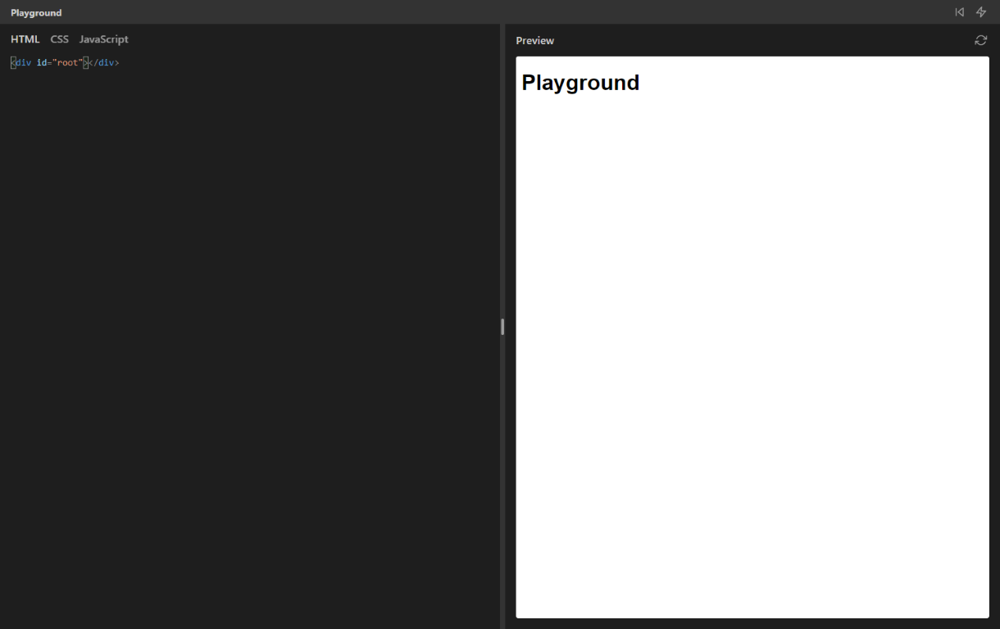

# Playground

A browser playground for HTML, CSS and JavaScript.

## Why

I often find myself needing to quickly prototype pages or experiment with React components. Now, I could create a local index.html file, paste the React CDN links in, and open it in the browser, but that is such a chore. Also, I needed an excuse to play with a bunch of tools I had not used before.

## Features

- JavaScript transpilation (using `esbuild-wasm` with the `jsx` loader)
- Built-in React for easy prototyping (use `render()` as a shorthand to `ReactDOM.render()` or `root.innerHTML = ''`)
- Single-click formatting using Prettier
- Resizable panes
- Basic state persistence using local storage

## Usage

If you like this, I would recommend forking and hosting it yourself in a way that would be convenient for you. [Vercel](vercel.com/) and their no-frills domain management is an excellent choice as of this moment.

## Credits

Inspired by similar tools such as the one [Josh Comeau](https://www.joshwcomeau.com/) built for his course platform, which itself was apparently built on top of [agneym/playground](https://github.com/agneym/playground).
